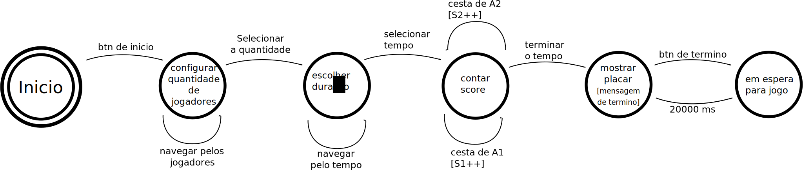

## Descrição
Simula, em escala reduzida, um jogo de basket entre dois jogadores. Um placar para mostrar o tempo e o score. Duas cestas com microcontroladores que se comunicam com o microcontrolador do placar.

## Componentes
1. [HC-12](https://www.filipeflop.com/produto/modulo-rf-wireless-hc-12-com-antena/) x3
1. [HC-SR04](https://www.filipeflop.com/produto/sensor-de-distancia-ultrassonico-hc-sr04/) x2
1. [buzina](https://www.filipeflop.com/produto/modulo-buzzer-5v-passivo/) x3
1. [lcd](https://www.filipeflop.com/produto/display-lcd-shield-com-teclado-para-arduino/) x1
1. [botão](https://portuguese.alibaba.com/product-detail/tactile-tact-switch-momentary-push-button-switch-4-pin-dip-for-arduino-pcb-60618214513.html) x3
1. [led](https://www.filipeflop.com/produto/led-emissor-infravermelho-ir-5mm/) x2
    
## Maquina de estado placar

## Maquina de estado cestas

